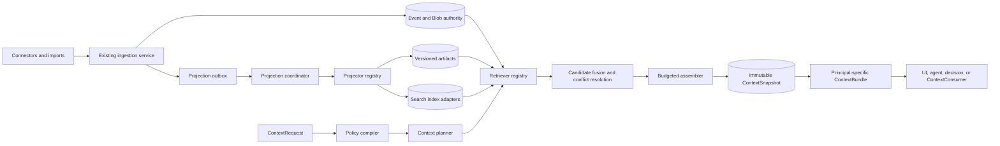

# Context Management Architecture

- **Chinese:** [../zh/CONTEXT_MANAGEMENT_ARCHITECTURE.md](../zh/CONTEXT_MANAGEMENT_ARCHITECTURE.md)
- **Status:** Design draft
- **Related:** [Product](PRODUCT.md) · [Message orchestration](MESSAGE_ORCHESTRATION.md) · [Context platform integration](CONTEXT_PLATFORM_INTEGRATION.md) · [RFC 0002](rfcs/0002-context-graph.md) · [RFC 0005](rfcs/0005-context-storage-lifecycle.md) · [RFC 0006](rfcs/0006-acl-agent-identity.md) · [RFC 0007](rfcs/0007-daily-distillation.md)

## 1. Purpose

Context management turns an authorized set of source events into a small,
traceable, purpose-specific context bundle for a human, an agent, or a decision.
It is not a larger prompt window, a second ingestion pipeline, or a vendor memory
database.

The design must support:

1. multiple message and collaboration sources without changing the kernel for
   every source;
2. current, historical, and as-of views without silently citing superseded facts;
3. deterministic replay of the exact context used by a decision or agent run;
4. ACL filtering before retrieval and ranking;
5. a useful baseline without an LLM, vector index, graph engine, or reranker;
6. local SQLite deployment and organizational PostgreSQL deployment behind the
   same domain contracts.

This document refines the accepted context RFCs into implementation boundaries.
The RFCs remain authoritative where they define domain semantics.

## 2. Architectural Invariants

### 2.1 Event and Blob remain the authority

Existing `IngestRecord -> Event + Blob` processing remains the only route for
source evidence. Context management does not introduce another canonical event
schema and does not let a connector write context objects directly.

- Event identity, revision, tombstone, source time, and ingestion time remain
  append-oriented authority data.
- Message bodies and artifact bodies remain content-addressed Blobs.
- Low-salience evidence may be excluded from a hot index or bundle, but it is not
  rejected from ingestion for that reason.

### 2.2 Derived context is replaceable

Summaries, claims, identity links, topic assignments, embeddings, graph edges,
and ranking traces are projections over evidence. Every projection declares its
schema, algorithm version, input references, and generation. It may be rebuilt
without rewriting source Events.

### 2.3 Policy precedes relevance

The authorized candidate universe is computed before lexical, vector, graph, or
model ranking. Hidden resources do not participate in scores, result counts,
cache keys, or diagnostics visible to the caller.

### 2.4 Snapshots are immutable

A `ContextSnapshot` records an exact selection at a fixed read epoch. Changes to
evidence, policy, projection generation, or selection logic create a new
snapshot. Existing snapshots are never edited in place.

### 2.5 Capabilities degrade, invariants do not

A deployment may omit model, vector, graph, or rerank capabilities. It may return
less context, but it may not relax ACL, provenance, temporal correctness,
snapshot immutability, or budget enforcement.

### 2.6 Models propose; code governs

Models may propose summaries, claims, identity links, query interpretations, or
topic assignments. Deterministic code owns schema validation, evidence binding,
ACL derivation, state transitions, quotas, conflicts, and acceptance.

The optional `ContextQuestionAnswerer` is a bundle consumer, not a projector or
authority. It sends the fixed answering rules as a system message and the
question plus `ContextBundle` as a separate untrusted-data message. Code rejects
answers unless their candidate and Event citations bind back to that bundle.
Model failure or invalid output does not alter Events, Artifacts, snapshots, or
bundles.

## 3. Logical Architecture



The write path and read path are deliberately separate. Projection failures do
not block evidence ingestion. Retrieval never promotes a projection into
authority.

## 4. Core Domain Concepts

The following shapes are contracts, not storage schemas. Drivers may normalize
them differently while preserving their semantics.

### 4.1 `ContextRequest`

```ts
interface ContextRequest {
  schema_version: "1.0";
  id: string;
  org_id: string;
  principal: ActorRef;
  consumer_id: string;
  purpose: string;
  allowed_uses: Array<"display" | "reason" | "draft" | "execute">;
  query?: string;
  anchors?: Array<{
    kind: "event" | "conversation" | "work_item" | "decision" | "entity";
    id: string;
  }>;
  filters?: {
    sources?: string[];
    thread_ids?: string[];
    actor_ids?: string[];
    occurred_after?: string;
    occurred_before?: string;
  };
  temporal: ContextTemporalSelection;
  budget: ContextBudget;
  requested_kinds?: ContextCandidateKind[];
}

type ContextTemporalSelection =
  | { mode: "current"; valid_at?: never; recorded_at?: never }
  | { mode: "history"; valid_at?: string; recorded_at?: never }
  | { mode: "as_of"; valid_at?: string; recorded_at: string };
```

`purpose` and `allowed_uses` are authorization inputs, not descriptive labels.
The same principal may receive different bundles for display and execution.
`current` accepts no time override. `history` returns the lifecycle and may use
`valid_at` to select a world-time point. `as_of` requires `recorded_at` and may
also constrain `valid_at`.

### 4.2 `ContextArtifact`

```ts
interface ContextArtifact {
  id: string;
  org_id: string;
  kind:
    | "thread_summary"
    | "daily_digest"
    | "claim_extraction"
    | "identity_link"
    | "topic_assignment"
    | "query_interpretation";
  schema_version: string;
  algorithm_version: string;
  generation: string;
  input_refs: EvidenceReference[];
  input_hash: string;
  body_hash?: string;
  status: "proposed" | "accepted" | "rejected" | "needs_clarify" | "superseded";
  required_scope_ids: string[];
  recorded_at: string;
  supersedes_id?: string;
  attrs?: JsonValue;
}
```

Artifact payloads live in Blob storage. Accepted artifacts always retain
evidence references. A model response without evidence is a trace or proposal,
not accepted context. Artifacts that wrap or pin an RFC 0005 Digest preserve the
full Digest lifecycle, including `needs_clarify`; they do not replace that
record's authoritative status.

Identity and topic interpretation use artifacts rather than mutating Events:

- weak identity matches remain proposals until confirmed;
- identity split supersedes prior links and rebuilds affected projections;
- topic assignment is many-to-many, confidence-bearing, and versioned;
- no `canonical_topic_id` is written back into a source Event.

### 4.3 `ContextCandidate`

```ts
type ContextCandidateKind =
  | "event"
  | "digest"
  | "claim"
  | "entity"
  | "edge"
  | "artifact";

interface ContextCandidate {
  candidate_id: string;
  kind: ContextCandidateKind;
  resource_id: string;
  evidence: EvidenceReference[];
  required_scope_ids: string[];
  valid_from?: string;
  valid_to?: string;
  recorded_at: string;
  status?: "current" | "superseded" | "retracted";
  content_hash?: string;
  scores: Record<string, number>;
  estimated_tokens: number;
  conflicts?: string[];
  projection?: {
    projector_id: string;
    algorithm_version: string;
    generation: string;
  };
}
```

Retriever-specific scores remain named values. During fusion, core namespaces
each contribution by the canonical tuple `[retriever_id, score_name]`. A
versioned retrieval profile may weight that exact tuple or explicitly fall back
to a generic score-name weight; scores from different retrievers never collide
through a same-name maximum. The profile does not assume that BM25, cosine,
graph distance, and model scores share a numeric scale.

### 4.4 `ContextSnapshot`

```ts
interface ContextSnapshot {
  schema_version: "1.0";
  id: string;
  org_id: string;
  request_hash: string;
  principal_policy_hash: string;
  read_epoch: string;
  retrieval_profile_version: string;
  assembly_profile_version: string;
  bundle_payload_hash: string;
  selected: ContextSelectedReference[];
  budget_ledger: ContextBudgetLedger;
  degradation_flags: string[];
  content_hash: string;
  created_at: string;
}

type ContextSelectedReference =
  | {
      candidate_id: string;
      resource_id: string;
      kind: "event";
      content_hash: string;
    }
  | {
      candidate_id: string;
      resource_id: string;
      kind: Exclude<ContextCandidateKind, "event">;
      content_hash?: string;
      projection_generation: string;
    };
```

`bundle_payload_hash` pins the complete canonical bundle payload except for its
snapshot ID and bundle hash. Each selected Event requires `content_hash`. Every projection-derived selection
requires `projection_generation` and may also pin `content_hash`. The snapshot
therefore pins identifiers, hashes or generations, and policy versions. It does
not expose a bare Blob capability.

Canonical hashes use UTF-8 JSON with object keys sorted by JavaScript code-unit
order. Array order is preserved because selected and rendered order is semantic.
Undefined object properties are omitted; `-0` is normalized to `0`; non-finite
numbers and non-plain objects are rejected. Request hashes exclude the generated
request ID. Snapshot hashes exclude only snapshot ID and the hash field itself;
`created_at` is semantic. A valid snapshot ID is exactly
`context-snapshot:${content_hash}`, which roots replay integrity in the ID used
for storage lookup. Bundle hashes exclude only their hash field. Fixed fixtures
lock these rules; changing their semantics requires a contract version change.

### 4.5 `ContextBundle`

```ts
interface ContextBundle {
  schema_version: "2.0";
  snapshot_id: string;
  org_id: string;
  principal: ActorRef;
  consumer_id: string;
  purpose: string;
  allowed_uses: Array<"display" | "reason" | "draft" | "execute">;
  sections: Array<{
    kind: "policy" | "memory" | "working" | "facts" | "summaries" | "evidence";
    items: ContextBundleItem[];
    tokens: number;
  }>;
  citations: EvidenceReference[];
  conflicts: ContextConflict[];
  redactions: ContextRedaction[];
  budget_ledger: ContextBudgetLedger;
  degradation_flags: string[];
  content_hash: string;
}

interface ContextRedaction {
  section: ContextSectionKind;
  category: string;
  count: number;
}
```

`EvidenceBundle` v1 remains supported. Bundle v2 is a new projection over a
snapshot, not a breaking reinterpretation of the v1 event-reference contract.
Bundle v2 `redactions` contain only opaque section, category, and count
information. They never contain omitted claim or resource IDs. A separately
authorized audit resource may expose such IDs only after an RFC amendment; it
does not widen the `ContextRedaction` contract.

### 4.6 `ContextBuildTrace`

Build traces contain retriever timing, candidate counts, score contributions,
budget decisions, and projection versions. They are internal audit resources.
Caller-visible traces must not reveal hidden resource IDs or pre-filter counts.

## 5. Time Semantics

Time uses two independent axes:

| Axis | Meaning | Fields |
| --- | --- | --- |
| Valid time | When a statement is true in the represented world | `valid_from`, `valid_to` |
| Recorded time | When Regenic knew or changed the statement | `recorded_at`, `superseded_at`, `retracted_at` |

Events retain `occurred_at` and `ingested_at`. Claims and other semantic
artifacts use the valid/recorded vocabulary above. `current`, `history`, and
`as_of` queries compile into explicit predicates; callers do not infer time by
sorting text matches.

For `as_of`, maximum-age filtering and recency scoring use the request's
`temporal.recorded_at`; `current` and `history` use the authority read time.
The requested as-of recorded time must not exceed the authority read's
`recorded_at`; an older read cannot prove a future knowledge state.
Request timestamps are UTC-normalized before request hashing. By contrast, an
`EvidenceReference.occurred_at` is an authoritative recorded representation and
participates in evidence, snapshot-payload, and bundle hashes literally. Source
adapters must preserve it rather than rewrite an equivalent offset spelling.

Superseded context is not silently discarded. When relevant to the request, the
bundle labels both current and superseded statements with their validity ranges.

## 6. Ports and Ownership

### 6.1 Privileged core

The core owns:

- Event/Blob ingestion and source idempotency;
- artifact state transitions and evidence integrity;
- ACL evaluation and purpose checks;
- read epochs, snapshot immutability, and deterministic hashing;
- temporal conflict rules;
- hard budgets, quotas, and visible diagnostics;
- audit records for context publication.

### 6.2 Plugin ports

```ts
interface ContextEvidenceSource {
  openRead(request: ContextRequest): Promise<ContextSourceRead>;
}

interface ContextSourceRead {
  read_epoch: string;
  recorded_at: string;
  lifecycle_complete: true;
  lifecycle_heads: Array<{
    source: string;
    external_id: string;
    head_event_id: string;
  }>;
  events: ContextSourceEvent[];
}

interface ContextPolicyEvaluator {
  policyHash(request: ContextRequest): Promise<string>;
  visible(input: ContextVisibilityInput): Promise<boolean>;
  protectedEventIds(plan: AuthorizedRetrievalPlan): Promise<string[]>;
  canReplay(input: ContextReplayInput): Promise<boolean>;
}

interface ContextAuthorityReader {
  openContextRead(orgId: string): Promise<{
    read_epoch: string;
    recorded_at: string;
    events: Array<EventRecord & { content_media_type?: string }>;
    lifecycle_heads: ContextLifecycleHead[];
  }>;
}

interface ContextProjector {
  readonly id: string;
  readonly algorithm_version: string;
  capabilities(): ProjectionCapabilities;
  project(input: ProjectionInput): Promise<ContextArtifactProposal[]>;
}

interface ContextRetriever {
  readonly id: string;
  capabilities(): RetrievalCapabilities;
  retrieve(plan: AuthorizedRetrievalPlan): Promise<ContextCandidate[]>;
}

interface ContextArtifactStore {
  putArtifact(input: ContextArtifactWrite): Promise<ContextArtifact>;
  getArtifact(orgId: string, id: string): Promise<ContextArtifact | null>;
  listArtifacts(query: ArtifactQuery): Promise<ContextArtifact[]>;
  putSnapshot(input: ContextSnapshot): Promise<void>;
  getSnapshot(orgId: string, id: string): Promise<ContextSnapshot | null>;
  putBundle(input: ContextBundle): Promise<void>;
  getBundle(query: ContextBundleLookup): Promise<ContextBundle | null>;
  putCheckpoint(input: ProjectionCheckpoint): Promise<void>;
  getCheckpoint(
    orgId: string,
    projectorId: string,
    generation: string,
  ): Promise<ProjectionCheckpoint | null>;
}
```

Optional retriever capabilities are declared, not inferred:

```ts
interface RetrievalCapabilities {
  lexical: boolean;
  vector: boolean;
  graph: boolean;
  rerank: boolean;
  multilingual: boolean;
}
```

Proposed plugin-host service keys:

| Key | Port |
| --- | --- |
| `context` | `ContextEngine` |
| `context-artifacts` | `ContextArtifactStore` |
| `context-projectors` | `ContextProjectorRegistry` |
| `context-retrievers` | `ContextRetrieverRegistry` |

Projectors and retrievers may return proposals or candidates. They cannot widen
ACLs, accept claims, mutate Events, or publish bundles independently. An
Event-only retriever publishes evidence candidates only. The privileged policy
evaluator explicitly returns protected Event IDs from the authorized lifecycle
view; core validates those IDs and alone promotes their sections to `policy`.

The authority adapter returns every Event needed to verify each
`(source, external_id)` lifecycle and exactly one declared head for each
identity. Core rejects missing parents, invalid create/revise/tombstone shapes,
cycles, forks, scope or thread drift, non-monotonic parent-to-child
`occurred_at` or `ingested_at`, and declared heads that do not match the returned
chain. Every temporal slice must remain parent-closed; an orphaned revision or
tombstone fails the request. The read's `recorded_at` must be at or after every
returned Event's `ingested_at`; a read cannot declare a complete head that lies
in its own future. Together with the as-of coverage rule, these constraints
define the read's closed recorded-time window. `lifecycle_complete` without a
matching head manifest is not a sufficient boundary.

Canonical ingestion persists each new Event's stable thread ID, actor ID, and
source-scoped ACL requirement with the Event transaction. The SQLite reader
returns those fields, Blob media metadata, lifecycle heads, and a content-bound
read epoch from one read transaction. The evidence-source adapter reads bodies
only through hashes from those committed Events. Legacy Events without persisted
ACL metadata, and identities whose lifecycle cannot be closed from one create
root, are excluded as a whole rather than treated as public.

## 7. Build Flow

1. Validate `ContextRequest`, principal status, purpose, and allowed use.
2. Fix an authority `read_epoch`, verify lifecycle head manifests, and fix
  projection generations.
3. Authorize complete lifecycle chains before resolving status, then compile
  temporal constraints into an authorized retrieval plan.
4. Ask the privileged policy evaluator to declare protected Event IDs from that
  plan, then run available retrievers over only the authorized universe.
5. Normalize candidates by stable resource identity and evidence lineage; core
  promotes only validated protected IDs to the `policy` section.
6. Fuse ranks according to a versioned profile; then apply deterministic
   authority, temporal, and conflict rules.
7. Diversify and allocate candidates against a named budget profile.
8. Persist the immutable snapshot and its budget ledger.
9. Project the snapshot for the requested principal and consumer.
10. Publish or return the bundle and write an audit event.

Exact fusion algorithms and weights are profile configuration validated by an
evaluation set. They are not domain constants.

## 8. Projection Reliability

Evidence ingestion and projection scheduling use a transactional outbox. The
authority transaction writes the Event and an outbox record together.

### 8.1 Personal SQLite baseline

The Personal implementation persists one idempotent outbox job for every
created, revised, or tombstoned Event in the same SQLite transaction as the
Event and source-head update. A post-listen worker claims due jobs with a
bounded lease, groups a batch by organization, and runs the projection
coordinator once per organization. A crash after projection but before job
completion causes safe replay: immutable Artifact writes and monotonic
checkpoints make the projection idempotent. Failed jobs store only a stable
error code and retry with bounded exponential backoff.

The D0 `thread-summary-deterministic` projector requires no model. At a fixed
authority read epoch it groups evidence by thread, resolves each source
lifecycle to its declared head, uses revised text, excludes tombstoned text,
and emits a structured `thread_summary`. Its ID, input hash, body hash,
Evidence references, and scope union are deterministic. The canonical summary
body is content-addressed in Blob storage; the Artifact remains a replaceable,
evidence-bound proposal rather than authority.

### 8.2 Personal lexical index

Personal uses a separate, rebuildable SQLite FTS5 sidecar. The projection
outbox updates summaries and lexical documents before completing a leased job;
long runs renew their leases. A missing sidecar or changed generation triggers
an atomic organization rebuild. Content-hash repointing requeues affected
Events, and a checkpoint may advance to a newer content watermark at the same
Event count only when its recorded time also moves forward.

FTS receives literal Unicode terms, never raw `MATCH` syntax. The versioned
tokenizer applies NFKC and lowercase normalization plus deterministic one- to
three-character CJK n-grams. Oversized documents remain uncovered and use the
correctness fallback instead of consuming unbounded index resources. FTS is a
candidate accelerator, not an authority or rank oracle: v1 exposes no global
BM25, snippets, corpus counts, principal, policy, or hidden-resource metadata.

Projectors follow these rules:

- idempotency key: `(projector_id, algorithm_version, event_id)`;
- checkpoint scope: at least `(org_id, projector_id, generation)`;
- retry is at-least-once; artifact writes are idempotent;
- rebuild writes a new generation and switches it atomically after completion;
- an incomplete generation is never mixed into a snapshot;
- a failed projector does not block Event ingestion or unrelated projectors.

### 8.1 Artifact lifecycle authority

Artifact manifests are immutable. Their effective lifecycle state is held in a
separate authority record so a proposal can be accepted, rejected, or marked
`needs_clarify` without rewriting its evidence, scope, or body hash. An accepted
Artifact can be superseded only by a proposal whose `supersedes_id` names it;
the authority transaction accepts the replacement and marks the previous
Artifact superseded together. Terminal Artifacts cannot transition again.

Only accepted `thread_summary` Artifacts are eligible for retrieval. The
retriever loads the canonical body through `body_hash`, verifies it matches the
immutable manifest, requires every evidence reference in the authorized source
view, and requires an exact evidence-scope union. Failure to verify any of
these conditions withholds the Artifact rather than falling back to a prior
summary.

### 8.2 UTC daily digest D0

The Personal baseline includes an explicit UTC-day D0 projector. A caller names
the `YYYY-MM-DD` period; the system never substitutes the host timezone or an
implicit "today". It selects current non-tombstoned lifecycle heads whose
`occurred_at` falls in that UTC date, retains every Event in each selected
lifecycle as evidence, and emits a deterministic `daily_digest` proposal. The
canonical body lists the current head per thread in stable order and is bound by
an Artifact ID, input hash, scope union, and body hash.

Projection creates a proposal only. The ordinary Artifact lifecycle must accept
it before the Personal API or CLI returns it. Revision and tombstone correctness
therefore comes from the same lifecycle-head validation as Context retrieval.
This is intentionally not RFC 0007's scored, direction-aware distillation:
direction tags, weight hints, organization timezone and append-only decision
history are separate prerequisites. D0 does not claim artifact as-of retrieval
or automatic midnight scheduling.

Projection dependencies form a declared DAG. For example, a daily digest may
depend on accepted thread summaries, but a lexical Event retriever does not.
The coordinator rejects dependency cycles.

## 9. ACL and Privacy

- `visible(principal, resource, purpose)` is applied before every retrieval
  channel and again before bundle projection.
- Blob bodies are materialized only after whole-lifecycle authorization and
  temporal resolution. The index receives only exact authorized
  `(event_id, content_hash)` keys; unknown, stale, or duplicate keys fail closed.
- Caller-visible read epochs are derived from authorized lifecycle metadata and
  the policy hash, so hidden lifecycle changes do not perturb snapshots.
- Lifecycle authorization is all-or-nothing. If any revision or tombstone in an
  identity chain is not visible, no member or derived status from that chain is
  exposed to retrievers.
- An artifact derives `required_scope_ids` from all evidence. A projector cannot
  choose a wider scope.
- Blob reads require an authorized `via_event_id`, `via_artifact_id`, or
  `via_snapshot_id`; raw content hashes are not bearer capabilities.
- Personal and organizational evidence stay in separate policy domains by
  default. Cross-domain assembly requires explicit scope selection and audit.
- Cache keys include principal-policy hash, purpose, temporal mode, budget
  profile, read epoch, and projection generations.
- Redaction reports may identify omitted bundle slots, but must not reveal hidden
  resource IDs to an unauthorized caller.

Erasure, legal hold, and immutable snapshot replay require a separate lifecycle
decision. Until that decision is accepted, implementations must not claim both
permanent byte-for-byte replay and unconditional physical erasure.

## 10. Storage and Deployment

The same ports support both deployment profiles:

| Capability | Personal default | Organization default |
| --- | --- | --- |
| Authority and artifacts | SQLite | PostgreSQL |
| Blob bodies | Local content-addressed files | S3-compatible object storage |
| Lexical retrieval | SQLite FTS5, with metadata fallback | PostgreSQL FTS or search plugin |
| Vector retrieval | Optional | pgvector or external plugin |
| Graph traversal | Relational adjacency / recursive query, optional | PostgreSQL or graph plugin |
| Jobs | In-process lease/outbox worker | Durable queue worker |
| Cache | In-process bounded cache | Optional Redis plugin |

PostgreSQL, pgvector, OpenSearch, Neo4j, Azure AI Search, and model vendors are
driver choices. None are required by the domain model.

The Personal SQLite authority plugin also provides `context-artifacts` from its
existing split reader/writer instance. Artifact manifests, snapshots, bundles,
and projection checkpoints are stored as validated canonical JSON with indexed
lookup columns. Artifact, snapshot, and bundle writes are immutable and
idempotent; checkpoint advancement is monotonic within one projector generation.
Clearing an organization's operational data deletes these context records in
the same transaction as its Event-derived state, while connector, executor, and
recipe configuration remains intact.

The Personal API host mounts the authority-backed evidence source, deterministic
indexed Event retriever, personal-owner policy, and durable context engine as
one plugin lifecycle. The FTS database and its WAL files are migrated, parked,
restored, measured, and wiped with the authority database. Organization clear
uses SQLite secure deletion, a truncated WAL, and vacuum for the lexical
sidecar. Replay reads the persisted snapshot and bundle without rerunning the
source, retriever, or a model.

## 11. Graceful Degradation

The planner builds a capability-aware plan and records missing capabilities:

| Missing capability | Required behavior |
| --- | --- |
| Model | Use deterministic query parsing and D0 projection rules |
| Vector | Use lexical, time, thread, actor, and exact-entity retrieval |
| Graph | Omit graph expansion or use bounded relational adjacency |
| Reranker | Use deterministic fused rank and authority/time rules |
| Artifact projector | Retrieve authorized Events directly |
| FTS | Use indexed metadata and bounded recent/thread scans |

Runtime flags distinguish `lexical_index_absent`,
`lexical_index_unbuilt`, and `lexical_index_partial`. Exact content-hash
coverage determines freshness. Uncovered authorized Events are verified by the
same versioned local lexical algorithm, so index loss or lag changes latency,
not authorization or recall correctness.

`degradation_flags` make quality differences observable. Missing optional
capabilities never disable ACL or provenance checks.

## 12. Budgeted Assembly

Budgets are named, versioned profiles rather than one global token table. A
request may constrain total tokens, per-section tokens, item count, raw evidence
count, and maximum age.

`max_raw_evidence` counts content-bearing Event items exposed anywhere in the
bundle, not citation references and not only items placed in the evidence
section. Citations remain mandatory provenance and carry no raw body by
themselves.

The assembler emits a ledger containing requested, selected, truncated, and
reserved capacity per section. Its default reduction order is profile-specific.
Protected Event IDs are an explicit privileged policy decision, including the
empty set; retrievers cannot self-promote candidates. Every declared protected
Event must be retrieved and fit the hard budget before ordinary evidence, or
assembly fails rather than silently omitting mandatory safety context.

The first implementation uses deterministic token estimates. Model-specific
tokenizers may be optional adapters; they cannot change which resources are
authorized.

## 13. Observability and Evaluation

Required operational measures include:

- projection lag and failed checkpoints by projector version;
- snapshot build P50/P95 and candidate count after authorization;
- selected tokens and truncation by budget section;
- citation coverage and artifacts without evidence;
- current-versus-superseded citation error rate;
- retrieval recall on temporal, cross-source, multilingual, and ACL fixtures;
- snapshot replay success and content-hash stability;
- storage footprint by Event, Blob, Artifact, index, and snapshot.

Evaluation fixtures use synthetic identities and content. Production messages do
not become test fixtures or prompt examples.

The deterministic evaluation runner reports Recall@K, MRR@K, nDCG@K, citation
coverage, negative-case selection rate, and forbidden/stale selections. Empty
ground-truth cases are safety negatives and do not inflate quality means. The
hard gate requires no forbidden or stale selection, no negative-case selection,
and complete citation coverage. Reports contain Event IDs and hashes but no
message bodies or timing-dependent fields; identical inputs produce the same
report hash.

## 14. First Vertical Slice

The first slice is **request-driven Evidence Bundle v2 with deterministic
snapshots**. It deliberately excludes LLM extraction, vector search, topic
clustering, and a graph database.

Public contract implementation starts only after Context Request/Snapshot/Bundle
v2, replay guarantees, read-epoch semantics, and canonical hash scope pass an
explicit RFC or architecture approval gate. Before that gate, examples in this
document remain provisional design shapes.

Deliverables:

1. domain contracts for request, candidate, artifact envelope, snapshot, bundle,
   budget ledger, and capability flags;
2. deterministic Event retriever using source, thread, time, revision/tombstone,
   and lexical filters;
3. deterministic planner and budgeted assembler;
4. SQLite artifact/snapshot/checkpoint storage;
5. a personal API endpoint and local CLI path for assemble and replay;
6. compatibility projection to the existing `EvidenceBundle` v1 consumer;
7. synthetic conformance fixtures for ACL, revision, tombstone, replay, budget,
   and no-model degradation.

Acceptance criteria:

- identical request and read epoch produce the same snapshot content hash;
- each authority read has a verified lifecycle head manifest, and hidden
  successors expose neither stale content nor lifecycle status;
- a new revision or tombstone creates a new snapshot while the old snapshot
  remains replayable within retention policy;
- only the policy evaluator can declare protected Events, all of which must fit;
- every selected item has an evidence path;
- unauthorized evidence affects neither rank nor diagnostics;
- hard budgets are never exceeded;
- no-model, no-vector, no-graph deployment still produces a valid bundle;
- the bundle contains no connector credentials, quarantine body, bare Blob
  capability, or uncommitted source record.

## 15. Delivery Sequence

1. Approve Context Request/Snapshot/Bundle v2, replay, read epoch, and canonical
  hash semantics; then add contracts and conformance tests.
2. Deterministic Event-only planner and assembler.
3. SQLite snapshot/artifact store and replay.
4. API/CLI integration and `EvidenceBundle` v1 compatibility.
5. Projection outbox and D0 structured summaries. **Implemented for Personal SQLite.**
6. Lexical index adapter and evaluation harness. **Implemented for Personal SQLite.**
7. Optional model, vector, graph, and rerank plugins.
8. Bitemporal Claim promotion after its query semantics are accepted.
9. Identity and topic lifecycle after their governance RFCs are accepted.

## 16. Decisions Requiring RFCs

The following decisions change shared semantics and require explicit review:

1. Context Request/Snapshot/Bundle v2 and replay guarantees.
2. Identity link, confirmation, split, and ACL impact lifecycle.
3. Topic assignment merge/split and human naming lifecycle.
4. Bitemporal Claim query semantics across current/history/as-of modes.
5. Search capability and ACL-before-ranking conformance.
6. Artifact provenance, model versioning, and acceptance governance.
7. Personal/organizational evidence mixing and cross-domain authorization.
8. Erasure, legal hold, body redaction, and snapshot replay guarantees.

These decisions must be made before their corresponding advanced projection is
treated as authoritative.