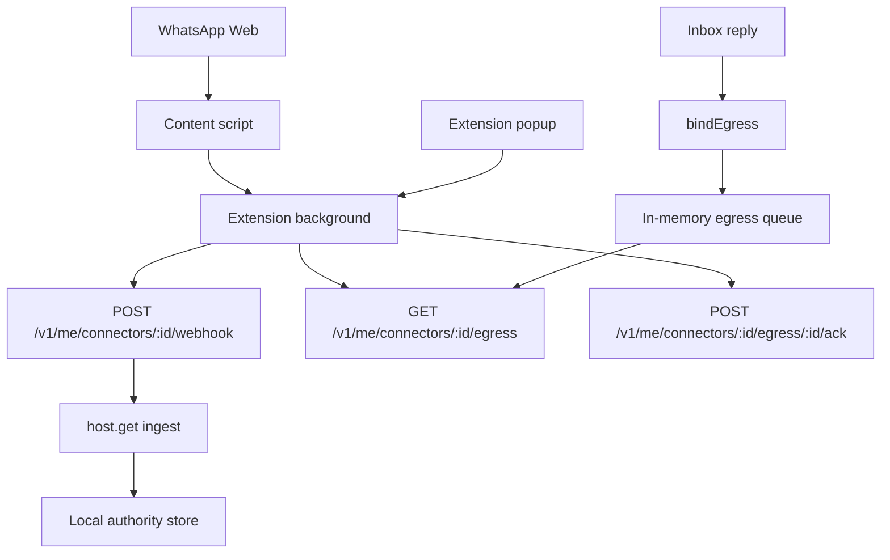

# WhatsApp Web Live Connector

- **Chinese:** [../zh/WHATSAPP_WEB_LIVE_CONNECTOR.md](../zh/WHATSAPP_WEB_LIVE_CONNECTOR.md)
- **Related:** [Personal WhatsApp Bridge](WHATSAPP_PERSONAL.md) · [Connectors](CONNECTOR.md) · [Built-in connectors](CONNECTOR_DRIVERS.md) · [Test and acceptance](WHATSAPP_PERSONAL_TESTING.md)
- **Status:** Local MVP
- **Driver:** `whatsapp-web-live`
- **Source:** `whatsapp-personal` (same as a personal export import)
- **Source mode:** `webhook`

## Boundary

The WhatsApp Web live connector is a local `ChannelDriver`. A user who is
already signed in to WhatsApp Web can sync **visible chats in the left list**
(the extension clicks through them, up to 30), ingest those messages through
the ordinary connector webhook, and reply from Inbox. If Inbox replies to a
chat that is not open, the extension opens that conversation first.

This path does not use the WhatsApp Business API, does not bypass browser
login, does not collect cookies, does not store data in the cloud, and must
not be used for bulk messaging or unsolicited automation. Regenic does not
publish the extension to a browser store.

Chat identity is the WhatsApp JID (`@c.us`, `@g.us`, `@lid`), the same
identity a Purr / Export import uses. Visible titles are labels only. Title
slugs and unrecognized DOM rows are dropped, not ingested as messages.

Sending goes through `bindEgress`. Inbox reply means the user already
confirmed the text (`send_now: true`). The extension still will not click
WhatsApp's send button unless **Allow commands to click WhatsApp's send
button** is also enabled.

## Architecture



The extension uses localhost HTTP. The kernel owns ingest and reply. The
content script observes the page, clicks through visible chats, and applies
queued commands to the target conversation. All live HTTP goes through the
extension background worker, so WhatsApp Web is not a CORS origin for the
personal API.

**Sync visible chats** asks the background worker to restore the long-running
content script after an extension reload or WhatsApp page refresh. A
one-shot page probe is read-only and does not ingest messages.

## Install

Start the personal API on loopback. You do **not** set a live-key environment
variable first.

```powershell
$env:LISTEN_HOST="127.0.0.1"
$env:PORT="4370"
$env:REGENIC_DATABASE="$PWD\regenic.db"
$env:REGENIC_BLOB_ROOT="$PWD\blobs"
pnpm --filter @regenic/api start
```

In Engine, install **WhatsApp Web**. The button is available immediately.
Install creates a **pairing code** (stored in the machine keychain) and shows
it once so you can paste it into the extension. That code proves the extension
is talking to your local Regenic. It is not a WhatsApp password.

`REGENIC_PERSONAL_LIVE_KEY` remains an optional CLI override. The product
never asks you to set it. The driver is a singleton.

The extension then uses the generic connector routes. There is no
`/v1/me/live/whatsapp/*` API.

| Method | Path | Purpose |
| --- | --- | --- |
| `GET` | `/v1/me/engine` | Find the enabled `whatsapp-web-live` installation |
| `POST` | `/v1/me/connectors/:id/webhook` | Ingest one observed WhatsApp Web message |
| `GET` | `/v1/me/connectors/:id/egress` | Poll pending send commands |
| `POST` | `/v1/me/connectors/:id/egress/:commandId/ack` | Acknowledge a command |
| `GET` | `/v1/me/connectors/:id/pairing-code` | Reveal the pairing code for the extension |
| `POST` | `/v1/me/replies` | Queue a send through `bindEgress` |

The extension sends the pairing code as `x-regenic-live-key`. Any request
with a browser Origin header is rejected unless the pairing code (or the
optional env override) matches. A local CLI request without an Origin header
remains available. The driver also rejects work if the API is not bound to a
loopback host.

Commands expire after five minutes. The in-memory queue is isolated by
installation, accepts at most 100 pending commands, and rate-limits a chat
to one enqueue every two seconds.

## Build And Load The Extension

```powershell
pnpm --filter @regenic/web-extension-whatsapp build
```

Load it in Edge or Chrome:

1. Open `edge://extensions` or `chrome://extensions`.
2. Enable developer mode.
3. Select **Load unpacked**.
4. Choose `packages/web-extension-whatsapp/dist`.
5. After a code change, click **Reload**, then refresh any open WhatsApp Web tab.
6. Click the toolbar icon (pin it first if you want). The panel docks on the
   **right** of the browser, same as the X extension. Paste the **pairing code**
   from Engine after install.
   It is not a WhatsApp password. Leave the installation id and API address
   alone unless you changed them.
7. Open `https://web.whatsapp.com`, keep the left chat list visible, then select **Sync visible chats**. The extension clicks through the list (up to 30) and ingests them into Inbox.
8. Success shows `synced N chats`. A contact name is not an ID; the extension reverse-looks-up the WhatsApp ID from page data or local records.
9. Keep “click Send” off for first tests. Inbox replies open the matching chat, then fill the composer.

## Manual Test

1. Start the local API and install `whatsapp-web-live` in Engine. Copy the pairing code.
2. Build and load the extension.
3. Sign in to `https://web.whatsapp.com` yourself.
4. Keep the left chat list visible.
5. Open the popup and select **Sync visible chats**.
6. Send a unique message to this account from another WhatsApp account.
7. Open Regenic Inbox and confirm one WhatsApp item appears, `can_send` is
   true, `conversation_kind` is `direct` or `group`, and `event.source` is
   `whatsapp-personal`. The thread id is `whatsapp-personal:<jid>`.
   One WhatsApp chat must occupy one Inbox row. If an older build split a
   group into several rows, fold those orphans and sync again. Sync waits
   until the conversation pane is stable; phone-number chats match by digits,
   not exact title strings.
8. Reply from Inbox while that same chat stays open in WhatsApp Web:

```powershell
Invoke-RestMethod -Method Post `
  -Uri http://127.0.0.1:4370/v1/me/replies `
  -ContentType "application/json" `
  -Body '{"thread_id":"whatsapp-personal:15550001@c.us","text":"Test draft from Regenic"}'
```

9. Confirm the extension fills the composer without clicking send.
10. Enable the physical click only for a controlled test by turning on the
    extension send checkbox. Inbox replies are already confirmed sends.

## Safety Rules

- Keep the API bound to `127.0.0.1`.
- Paste the Engine pairing code into the extension. Do not put it in install config.
- Keep the extension API origin on loopback. The content script never calls
  the local API directly.
- Start with the extension send checkbox off.
- Do not queue commands for chats the extension cannot open.
- After any command delay, the extension checks the open chat again and switches back to the target if needed.
- Do not use this connector for bulk outreach, scraping, or unsolicited replies.
- Do not store production secrets, browser cookies, or npm tokens in the live
  connector.
- Before clicking Send, the extension stores the command UUID and the IDs of
  matching outgoing bubbles already on screen. It stores no message body. The
  command is acknowledged only after a new matching outgoing bubble appears.
  If delivery cannot be confirmed, the command remains pending but the
  extension does not click Send again; it expires with the server-side
  command TTL.
- A WhatsApp Web echo of an Inbox reply is stored under the same
  `:out:<command id>` identity, so it does not create a second message.

## Current MVP Limits

- The connector relies on WhatsApp Web DOM selectors and may break when the
  page changes.
- Messages without a WhatsApp JID are dropped. Group inbound messages keep
  two fields, same as whatsapp-web.js `author` + `notifyName`: `actor_id` is
  the participant phone JID when the bubble shows a number (`+34 …` →
  `3460…@c.us`), and `actor_label` is the display name (`~ Alex Diaz`).
  `fromMe` comes from WhatsApp's own outgoing flag (`true_` / `message-out` /
  send ticks), not from the push name in `data-pre-plain-text`. Your own
  bubbles are `local-owner` and show as You in Inbox; a name like
  `Jeson Li` is not treated as another person. Current WhatsApp Web often
  omits `true_`/`false_` on `data-id`; outgoing detection then uses send
  ticks / `tail-out` on the same row, and whether the bubble sits on the
  right. Re-syncing the same message with a corrected speaker revises the
  stored event, so Inbox replaces the old peer label instead of keeping it.
- Send commands are in-memory, expire after five minutes, and disappear when
  the API restarts.
- Sync covers chats currently visible in the list (up to 30 after scrolling),
  not a full offline export of history.
- Sending opens the target chat first. If the row cannot be found, the
  command stays pending until it expires.
- The MVP assumes one active extension instance. Commands are not leased
  across browsers or profiles.
- Automatic sending executes supplied text; it does not generate a reply.
- Diagnostic attach, ready, and popup self-test events are not ingested.
- WebSocket / native messaging can replace polling after the page automation
  path is stable.
