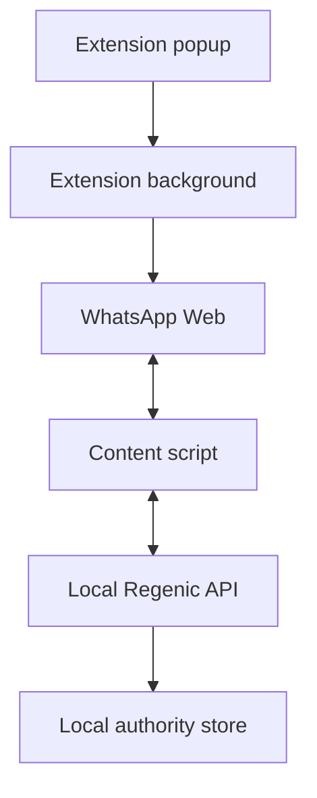

# WhatsApp Web Live Connector

- **Chinese:** [../zh/WHATSAPP_WEB_LIVE_CONNECTOR.md](../zh/WHATSAPP_WEB_LIVE_CONNECTOR.md)
- **Related:** [Personal WhatsApp Bridge](WHATSAPP_PERSONAL.md) · [Test and acceptance](WHATSAPP_PERSONAL_TESTING.md)
- **Status:** Local MVP

## Boundary

The WhatsApp Web Live Connector is a local browser-extension MVP for a user who
is already signed in to WhatsApp Web. It observes visible WhatsApp Web messages,
reports them to the local Regenic personal API, and polls local send commands.
Send commands are draft-only by default. The extension clicks WhatsApp's send
button only when the server command sets `send_now: true` and the extension
setting **Allow commands to click WhatsApp's send button** is enabled.

This connector does not use the WhatsApp Business API, does not bypass browser
login, does not collect cookies, does not store data in the cloud, and must not
be used for bulk messaging or unsolicited automation.

## Architecture



The extension uses localhost HTTP in the MVP. The API owns the HTTP surface;
the extension only observes the page, forwards message events, polls commands,
and applies commands to the currently open chat. **Reconnect page** asks the
background worker to restore the long-running content script after an extension
reload or WhatsApp page refresh.

## Local API

Start the personal API on loopback:

```powershell
$env:LISTEN_HOST="127.0.0.1"
$env:PORT="4370"
$env:REGENIC_DATABASE="$PWD\regenic.db"
$env:REGENIC_BLOB_ROOT="$PWD\blobs"
$env:REGENIC_PERSONAL_LIVE_KEY=[guid]::NewGuid().ToString("N")
pnpm --filter @regenic/api start
```

Live endpoints:

| Method | Path | Purpose |
| --- | --- | --- |
| `GET` | `/v1/me/live/whatsapp/status` | Check connector status |
| `POST` | `/v1/me/live/whatsapp/messages` | Receive observed WhatsApp Web messages |
| `POST` | `/v1/me/live/whatsapp/send` | Queue a draft or send command |
| `GET` | `/v1/me/live/whatsapp/commands` | Poll pending commands |
| `POST` | `/v1/me/live/whatsapp/commands/:id/ack` | Acknowledge a command |

Clients send `REGENIC_PERSONAL_LIVE_KEY` as `x-regenic-live-key`. Any request
with a browser Origin header is rejected unless the key is configured and
matches. A local CLI request without an Origin header remains available when the
key is unset, but configuring the key is recommended. The live connector is also
rejected if the API is not bound to a loopback host.

Commands expire after five minutes. The in-memory queue accepts at most 100
pending commands so an offline extension cannot accumulate unbounded or stale
work.

## Build And Load The Extension

Build the extension package:

```powershell
pnpm --filter @regenic/web-extension-whatsapp build
```

Load it in Edge or Chrome:

1. Open `edge://extensions` or `chrome://extensions`.
2. Enable developer mode.
3. Select **Load unpacked**.
4. Choose `packages/web-extension-whatsapp/dist`.
5. Open the popup and confirm that **Version** is present.
6. Open the extension settings.
7. Set **Local API origin** to `http://127.0.0.1:4370`.
8. Set **Live API key** to the value of `REGENIC_PERSONAL_LIVE_KEY`.
9. Keep **Allow commands to click WhatsApp's send button** off for first tests.
10. Use **Test connection**, then open WhatsApp Web and select **Reconnect page**.
11. Continue only when **Page scan** begins with `connected:`.

## Manual Test

1. Start the local API.
2. Build and load the extension.
3. Sign in to `https://web.whatsapp.com` yourself.
4. Open a test chat.
5. Open the popup and select **Reconnect page**.
6. Send a unique message to this account from another WhatsApp account.
7. Open Regenic Inbox and confirm a WhatsApp item appears once with the expected direction.
8. Queue a draft command within five minutes, replacing `<title-slug>` with the
   lowercase slug reported for the currently open chat:

```powershell
Invoke-RestMethod -Method Post `
  -Uri http://127.0.0.1:4370/v1/me/live/whatsapp/send `
  -Headers @{ "x-regenic-live-key" = $env:REGENIC_PERSONAL_LIVE_KEY } `
  -ContentType "application/json" `
  -Body '{"conversation_id":"whatsapp-personal:<title-slug>","text":"Test draft from Regenic","send_now":false}'
```

9. Keep that same chat open in WhatsApp Web.
10. Confirm the extension fills the composer without clicking send.
11. Enable send only for a controlled test by setting both `send_now: true` in
    the API request and the extension send checkbox.

## Safety Rules

- Keep the API bound to `127.0.0.1`.
- Set `REGENIC_PERSONAL_LIVE_KEY` for real testing.
- Start with draft-only mode.
- Do not queue commands for chats that are not currently open.
- Do not enable automatic sending when two chats can have the same visible title.
- Do not use this connector for bulk outreach, scraping, or unsolicited replies.
- Do not store production secrets, browser cookies, or npm tokens in the live connector.
- Before clicking Send, the extension stores the command UUID and the IDs of
  matching outgoing bubbles already on screen. It stores no message body. The
  command is acknowledged only after a new matching outgoing bubble appears.
  If delivery cannot be confirmed, the command remains pending but the extension
  does not click Send again; it expires with the server-side command TTL.

## Current MVP Limits

- The connector relies on WhatsApp Web DOM selectors and may break when the page changes.
- Chat identity is a low-confidence slug derived from the visible title. It is
  not a WhatsApp JID and cannot distinguish two chats with the same title.
- Commands are in-memory, expire after five minutes, and disappear when the API restarts.
- Only the currently open chat can receive a draft or send command.
- The MVP assumes one active extension instance. Commands are not leased or
  isolated across multiple browsers or profiles.
- Automatic sending executes supplied text; it does not generate a reply.
- The MVP does not yet include a full LLM reply pipeline or multi-platform dashboard.
- WebSocket/native messaging can replace polling after the page automation path is stable.