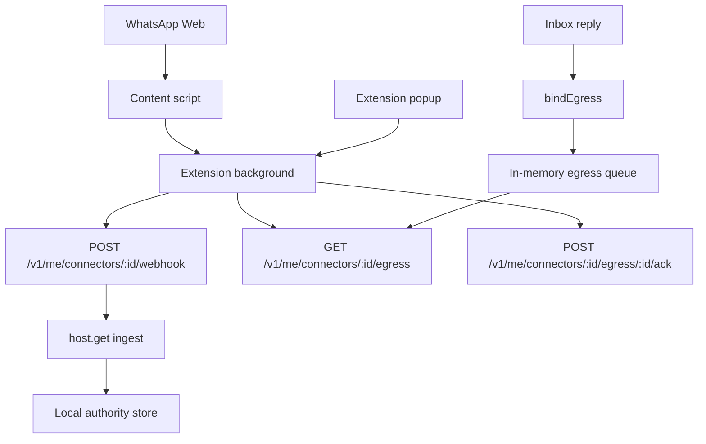

# WhatsApp Web Live Connector

- **Chinese:** [../zh/WHATSAPP_WEB_LIVE_CONNECTOR.md](../zh/WHATSAPP_WEB_LIVE_CONNECTOR.md)
- **Related:** [Personal WhatsApp Bridge](WHATSAPP_PERSONAL.md) · [Connectors](CONNECTOR.md) · [Built-in connectors](CONNECTOR_DRIVERS.md) · [Test and acceptance](WHATSAPP_PERSONAL_TESTING.md)
- **Status:** Local MVP
- **Driver:** `whatsapp-web-live`
- **Source:** `whatsapp-personal` (same as a personal export import)
- **Source mode:** `webhook`

## Boundary

The WhatsApp Web live connector is a local `ChannelDriver`. A user who is
already signed in to WhatsApp Web can observe the **currently open** chat
through a local MV3 extension, ingest those messages through the ordinary
connector webhook, and reply from Inbox.

This path does not use the WhatsApp Business API, does not bypass browser
login, does not collect cookies, does not store data in the cloud, and must
not be used for bulk messaging or unsolicited automation. Regenic does not
publish the extension to a browser store.

Chat identity is the WhatsApp JID (`@c.us`, `@g.us`, `@lid`), the same
identity a Purr / Export import uses. Visible titles are labels only. Title
slugs and unrecognized DOM rows are dropped, not ingested as messages.

Sending goes through `bindEgress`. Inbox reply means the user already
confirmed the text (`send_now: true`). The extension still will not click
WhatsApp's send button unless **Allow commands to click WhatsApp's send
button** is also enabled.

## Architecture



The extension uses localhost HTTP. The kernel owns ingest and reply. The
content script only observes the page and applies queued commands to the
currently open chat. All live HTTP goes through the extension background
worker, so WhatsApp Web is not a CORS origin for the personal API.

**Reconnect page** asks the background worker to restore the long-running
content script after an extension reload or WhatsApp page refresh. A
one-shot page probe is read-only and does not ingest messages.

## Install

Start the personal API on loopback and set the live key:

```powershell
$env:LISTEN_HOST="127.0.0.1"
$env:PORT="4370"
$env:REGENIC_DATABASE="$PWD\regenic.db"
$env:REGENIC_BLOB_ROOT="$PWD\blobs"
$env:REGENIC_PERSONAL_LIVE_KEY=[guid]::NewGuid().ToString("N")
pnpm --filter @regenic/api start
```

In Engine, install **WhatsApp Web** (`whatsapp-web-live`). The form does not
take the key; it reads `REGENIC_PERSONAL_LIVE_KEY` through
`credentials_ref`. The driver is a singleton.

The extension then uses the generic connector routes. There is no
`/v1/me/live/whatsapp/*` API.

| Method | Path | Purpose |
| --- | --- | --- |
| `GET` | `/v1/me/engine` | Find the enabled `whatsapp-web-live` installation |
| `POST` | `/v1/me/connectors/:id/webhook` | Ingest one observed WhatsApp Web message |
| `GET` | `/v1/me/connectors/:id/egress` | Poll pending send commands |
| `POST` | `/v1/me/connectors/:id/egress/:commandId/ack` | Acknowledge a command |
| `POST` | `/v1/me/replies` | Queue a send through `bindEgress` |

Clients send `REGENIC_PERSONAL_LIVE_KEY` as `x-regenic-live-key`. Any
request with a browser Origin header is rejected unless the key is
configured and matches. A local CLI request without an Origin header remains
available when the key is unset, but configuring the key is recommended.
The driver also rejects work if the API is not bound to a loopback host.

Commands expire after five minutes. The in-memory queue is isolated by
installation, accepts at most 100 pending commands, and rate-limits a chat
to one enqueue every two seconds.

## Build And Load The Extension

```powershell
pnpm --filter @regenic/web-extension-whatsapp build
```

Load it in Edge or Chrome:

1. Open `edge://extensions` or `chrome://extensions`.
2. Enable developer mode.
3. Select **Load unpacked**.
4. Choose `packages/web-extension-whatsapp/dist`.
5. Open the popup and confirm that **Version** is present.
6. Open the extension settings.
7. Set **Local API origin** to a loopback URL such as `http://127.0.0.1:4370`.
   Remote origins are rejected.
8. Set **Live API key** to the value of `REGENIC_PERSONAL_LIVE_KEY`.
9. Leave **Installation id** blank unless you need to pin a specific install.
10. Keep **Allow commands to click WhatsApp's send button** off for first tests.
11. Use **Test connection**, then open WhatsApp Web and select **Reconnect page**.
12. Continue only when **Page scan** begins with `connected:` and mentions a
    WhatsApp JID or `no WhatsApp chat id` (not a title slug).

## Manual Test

1. Start the local API and install `whatsapp-web-live` in Engine.
2. Build and load the extension.
3. Sign in to `https://web.whatsapp.com` yourself.
4. Open a test chat.
5. Open the popup and select **Reconnect page**.
6. Send a unique message to this account from another WhatsApp account.
7. Open Regenic Inbox and confirm one WhatsApp item appears, `can_send` is
   true, `conversation_kind` is `direct` or `group`, and `event.source` is
   `whatsapp-personal`. The thread id is `whatsapp-personal:<jid>`.
8. Reply from Inbox while that same chat stays open in WhatsApp Web:

```powershell
Invoke-RestMethod -Method Post `
  -Uri http://127.0.0.1:4370/v1/me/replies `
  -ContentType "application/json" `
  -Body '{"thread_id":"whatsapp-personal:15550001@c.us","text":"Test draft from Regenic"}'
```

9. Confirm the extension fills the composer without clicking send.
10. Enable the physical click only for a controlled test by turning on the
    extension send checkbox. Inbox replies are already confirmed sends.

## Safety Rules

- Keep the API bound to `127.0.0.1`.
- Set `REGENIC_PERSONAL_LIVE_KEY` for real testing.
- Keep the extension API origin on loopback. The content script never calls
  the local API directly.
- Start with the extension send checkbox off.
- Do not queue commands for chats that are not currently open.
- After any command delay, the extension re-reads the open chat and aborts if
  it changed.
- Do not use this connector for bulk outreach, scraping, or unsolicited replies.
- Do not store production secrets, browser cookies, or npm tokens in the live
  connector.
- Before clicking Send, the extension stores the command UUID and the IDs of
  matching outgoing bubbles already on screen. It stores no message body. The
  command is acknowledged only after a new matching outgoing bubble appears.
  If delivery cannot be confirmed, the command remains pending but the
  extension does not click Send again; it expires with the server-side
  command TTL.
- A WhatsApp Web echo of an Inbox reply is stored under the same
  `:out:<command id>` identity, so it does not create a second message.

## Current MVP Limits

- The connector relies on WhatsApp Web DOM selectors and may break when the
  page changes.
- Messages without a WhatsApp JID are dropped. Group inbound messages
  without a sender JID are also dropped.
- Send commands are in-memory, expire after five minutes, and disappear when
  the API restarts.
- Only the currently open chat can receive a send command.
- The MVP assumes one active extension instance. Commands are not leased
  across browsers or profiles.
- Automatic sending executes supplied text; it does not generate a reply.
- Diagnostic attach, ready, and popup self-test events are not ingested.
- WebSocket / native messaging can replace polling after the page automation
  path is stable.
