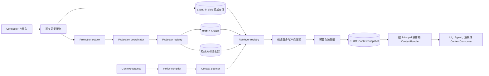

# 上下文管理架构

- **English:** [../en/CONTEXT_MANAGEMENT_ARCHITECTURE.md](../en/CONTEXT_MANAGEMENT_ARCHITECTURE.md)
- **状态：** 设计草案
- **相关：** [产品](PRODUCT.md) · [消息编排](MESSAGE_ORCHESTRATION.md) · [协作平台集成架构](CONTEXT_PLATFORM_INTEGRATION.md) · [RFC 0002](rfcs/0002-context-graph.md) · [RFC 0005](rfcs/0005-context-storage-lifecycle.md) · [RFC 0006](rfcs/0006-acl-agent-identity.md) · [RFC 0007](rfcs/0007-daily-distillation.md)

## 1. 目的

上下文管理把一组已授权的来源事件，转换成供人、Agent 或决策使用的小体积、可追溯、
按用途构建的上下文 bundle。它不是更大的 prompt window、第二条采集流水线，也不是某个
厂商的 memory 数据库。

该设计必须支持：

1. 接入多种消息与协作来源，而不是每加一个来源就修改内核；
2. 正确提供当前、历史与 as-of 视图，不静默引用已经被取代的事实；
3. 精确重放某次决策或 Agent run 当时使用的上下文；
4. 在检索与排序之前强制 ACL；
5. 没有 LLM、向量索引、图引擎或 reranker 时仍有可用基线；
6. 个人版 SQLite 与组织版 PostgreSQL 共用同一套领域合同。

本文把已接纳的上下文 RFC 细化为实现边界；RFC 已经定义的领域语义仍以 RFC 为准。

## 2. 架构不变量

### 2.1 Event 与 Blob 仍是权威底座

现有 `IngestRecord -> Event + Blob` 仍是来源证据进入系统的唯一入口。上下文管理不新增
第二套 canonical event schema，也不允许 connector 直接写上下文对象。

- Event identity、revision、tombstone、来源时间和采集时间继续采用追加式权威记录；
- 消息正文和 artifact 正文继续存入内容寻址 Blob；
- 低显著性证据可以不进入热索引或 bundle，但不能因此被采集层拒绝。

### 2.2 派生上下文必须可替换

摘要、Claim、身份链接、话题归属、embedding、图边和排序 trace 都是证据之上的投影。
每个投影声明 schema、算法版本、输入引用和 generation；重建投影不能改写来源 Event。

### 2.3 权限先于相关性

先确定已授权候选全集，再运行 lexical、vector、graph 或 model 排序。隐藏资源不能参与
分数、结果数量、缓存键，也不能出现在调用方可见的诊断中。

### 2.4 Snapshot 不可变

`ContextSnapshot` 在固定 read epoch 下记录一次精确选择。证据、策略、投影 generation
或选择算法发生变化，都要创建新 snapshot；现有 snapshot 永不原地修改。

### 2.5 能力可以降级，不变量不能降级

部署可以缺少 model、vector、graph 或 rerank 能力，返回的上下文可以更少，但不能放松
ACL、provenance、时序正确性、snapshot 不可变性或预算约束。

### 2.6 模型只提案，代码负责治理

模型可以提出摘要、Claim、身份链接、query interpretation 或话题归属。确定性代码负责
schema 校验、证据绑定、ACL 派生、状态转换、配额、冲突与接受。

可选的 `ContextQuestionAnswerer` 是 bundle consumer，不是 projector 或权威来源。固定回答
规则作为 system message 发送，question 与 `ContextBundle` 则放在独立的不可信 data message
中。只有当 answer 的 candidate 与 Event citation 能重新绑定到该 bundle 时，代码才接受
输出。模型失败或输出非法时，不修改 Event、Artifact、snapshot 或 bundle。

## 3. 逻辑架构



写路径与读路径刻意分离。投影失败不阻塞证据入库；检索也不能把投影自动晋升为权威。

## 4. 核心领域概念

下列结构是领域合同，不是固定数据库 schema。驱动可以采用不同的物理结构，但必须保持语义。

### 4.1 `ContextRequest`

```ts
interface ContextRequest {
  schema_version: "1.0";
  id: string;
  org_id: string;
  principal: ActorRef;
  consumer_id: string;
  purpose: string;
  allowed_uses: Array<"display" | "reason" | "draft" | "execute">;
  query?: string;
  anchors?: Array<{
    kind: "event" | "conversation" | "work_item" | "decision" | "entity";
    id: string;
  }>;
  filters?: {
    sources?: string[];
    thread_ids?: string[];
    actor_ids?: string[];
    occurred_after?: string;
    occurred_before?: string;
  };
  temporal: ContextTemporalSelection;
  budget: ContextBudget;
  requested_kinds?: ContextCandidateKind[];
}

type ContextTemporalSelection =
  | { mode: "current"; valid_at?: never; recorded_at?: never }
  | { mode: "history"; valid_at?: string; recorded_at?: never }
  | { mode: "as_of"; valid_at?: string; recorded_at: string };
```

`purpose` 与 `allowed_uses` 是授权输入，不是说明性标签。同一个 principal 用于展示和用于
执行时，可以获得不同 bundle。
`current` 不接受时间覆盖；`history` 返回生命周期，并可用 `valid_at` 选择现实时间点；
`as_of` 必须提供 `recorded_at`，也可以同时约束 `valid_at`。

### 4.2 `ContextArtifact`

```ts
interface ContextArtifact {
  id: string;
  org_id: string;
  kind:
    | "thread_summary"
    | "daily_digest"
    | "claim_extraction"
    | "identity_link"
    | "topic_assignment"
    | "query_interpretation";
  schema_version: string;
  algorithm_version: string;
  generation: string;
  input_refs: EvidenceReference[];
  input_hash: string;
  body_hash?: string;
  status: "proposed" | "accepted" | "rejected" | "needs_clarify" | "superseded";
  required_scope_ids: string[];
  recorded_at: string;
  supersedes_id?: string;
  attrs?: JsonValue;
}
```

Artifact payload 存在 Blob 中。已接受 artifact 必须保留 evidence reference。没有证据的
模型输出只能是 trace 或 proposal，不能成为已接受上下文。包装或钉住 RFC 0005 Digest
的 artifact 必须保留完整 Digest 生命周期，包括 `needs_clarify`，不能取代其权威状态。

身份与话题解释使用 artifact，不修改 Event：

- 弱身份匹配在确认前保持 proposal；
- 身份拆分 supersede 旧 link，并重建受影响投影；
- topic assignment 是多对多、带置信度、可版本化的关系；
- 不把 `canonical_topic_id` 回填到来源 Event。

### 4.3 `ContextCandidate`

```ts
type ContextCandidateKind =
  | "event"
  | "digest"
  | "claim"
  | "entity"
  | "edge"
  | "artifact";

interface ContextCandidate {
  candidate_id: string;
  kind: ContextCandidateKind;
  resource_id: string;
  evidence: EvidenceReference[];
  required_scope_ids: string[];
  valid_from?: string;
  valid_to?: string;
  recorded_at: string;
  status?: "current" | "superseded" | "retracted";
  content_hash?: string;
  scores: Record<string, number>;
  estimated_tokens: number;
  conflicts?: string[];
  projection?: {
    projector_id: string;
    algorithm_version: string;
    generation: string;
  };
}
```

Retriever 特有分数保留命名值。融合时，内核按 canonical tuple
`[retriever_id, score_name]` 为每项贡献建立 namespace。版本化 retrieval profile 可以为
该精确 tuple 设置权重，也可以显式回退到通用 score-name 权重；不同 retriever 的同名分数
不能通过取同名最大值发生碰撞。Profile 不能假设 BM25、cosine、图距离和模型分数处于同一
数值尺度。

### 4.4 `ContextSnapshot`

```ts
interface ContextSnapshot {
  schema_version: "1.0";
  id: string;
  org_id: string;
  request_hash: string;
  principal_policy_hash: string;
  read_epoch: string;
  retrieval_profile_version: string;
  assembly_profile_version: string;
  bundle_payload_hash: string;
  selected: ContextSelectedReference[];
  budget_ledger: ContextBudgetLedger;
  degradation_flags: string[];
  content_hash: string;
  created_at: string;
}

type ContextSelectedReference =
  | {
      candidate_id: string;
      resource_id: string;
      kind: "event";
      content_hash: string;
    }
  | {
      candidate_id: string;
      resource_id: string;
      kind: Exclude<ContextCandidateKind, "event">;
      content_hash?: string;
      projection_generation: string;
    };
```

`bundle_payload_hash` 钉住除 snapshot ID 与 bundle hash 之外的完整 canonical bundle
payload。每个选中的 Event 必须提供 `content_hash`；每个投影派生项必须提供
`projection_generation`，也可以同时钉住 `content_hash`。Snapshot 因而钉住 ID、hash
或 generation 和策略版本，不暴露裸 Blob 读取能力。

Canonical hash 使用 UTF-8 JSON，对 object key 按 JavaScript code-unit 顺序排序。Array
顺序保留，因为 selected 与渲染顺序属于语义。Object 中的 `undefined` 属性会被省略，`-0`
归一为 `0`，非有限数字和非 plain object 会被拒绝。Request hash 排除生成的 request ID；
Snapshot hash 只排除 snapshot ID 与 hash 字段本身，`created_at` 属于语义。合法 snapshot
ID 必须严格等于 `context-snapshot:${content_hash}`，从而把 replay 完整性锚定到存储查询使用
的 ID。Bundle hash 只排除自身 hash 字段。固定 fixture 锁定这些规则；若语义发生变化，
必须升级合同版本。

### 4.5 `ContextBundle`

```ts
interface ContextBundle {
  schema_version: "2.0";
  snapshot_id: string;
  org_id: string;
  principal: ActorRef;
  consumer_id: string;
  purpose: string;
  allowed_uses: Array<"display" | "reason" | "draft" | "execute">;
  sections: Array<{
    kind: "policy" | "memory" | "working" | "facts" | "summaries" | "evidence";
    items: ContextBundleItem[];
    tokens: number;
  }>;
  citations: EvidenceReference[];
  conflicts: ContextConflict[];
  redactions: ContextRedaction[];
  budget_ledger: ContextBudgetLedger;
  degradation_flags: string[];
  content_hash: string;
}

interface ContextRedaction {
  section: ContextSectionKind;
  category: string;
  count: number;
}
```

继续支持 `EvidenceBundle` v1。Bundle v2 是 snapshot 的新投影，不能破坏性地重新解释 v1
的 Event 引用合同。
Bundle v2 的 `redactions` 只包含不透明的 section、类别与数量，永不包含被省略的
claim/resource ID。只有在 RFC 修订后，独立且另行授权的审计资源才可暴露这些 ID；它不能
扩大 `ContextRedaction` 合同。

### 4.6 `ContextBuildTrace`

Build trace 记录 retriever 延迟、候选数量、分数贡献、预算选择和投影版本，属于内部审计资源。
调用方可见 trace 不能泄露隐藏资源 ID，也不能泄露 ACL 过滤前的候选数量。

## 5. 时间语义

时间使用两条独立轴：

| 时间轴 | 含义 | 字段 |
| --- | --- | --- |
| Valid time | 一条陈述在现实世界中何时成立 | `valid_from`, `valid_to` |
| Recorded time | Regenic 何时知道或改变该陈述 | `recorded_at`, `superseded_at`, `retracted_at` |

Event 继续保留 `occurred_at` 与 `ingested_at`。Claim 和其他语义 artifact 使用上述
valid/recorded 词汇。`current`、`history` 与 `as_of` query 编译成显式谓词；调用方不能通过
文本匹配排序猜测时间。

对于 `as_of`，最大 age 过滤与 recency 评分使用 request 的 `temporal.recorded_at`；
`current` 和 `history` 使用 authority read time。请求的 as-of recorded time 不能晚于
authority read 的 `recorded_at`；较旧 read 无法证明未来知识状态。Request timestamp 在
request hash 前归一为 UTC。相对地，`EvidenceReference.occurred_at` 是权威记录的字面表示，
按原值参与 evidence、snapshot payload 与 bundle hash。Source adapter 必须保留该值，不能
改写成等价的时区 offset 表示。

被取代的上下文不静默丢弃。如果与 request 有关，bundle 同时标记当前和 superseded 陈述，
并显示其有效时间范围。

## 6. 端口与所有权

### 6.1 特权内核

内核负责：

- Event/Blob 采集和来源幂等；
- artifact 状态转换与证据完整性；
- ACL 求值和 purpose 检查；
- read epoch、snapshot 不可变性与确定性 hash；
- 时序冲突规则；
- 硬预算、配额与调用方可见诊断；
- context 发布审计记录。

### 6.2 插件端口

```ts
interface ContextEvidenceSource {
  openRead(request: ContextRequest): Promise<ContextSourceRead>;
}

interface ContextSourceRead {
  read_epoch: string;
  recorded_at: string;
  lifecycle_complete: true;
  lifecycle_heads: Array<{
    source: string;
    external_id: string;
    head_event_id: string;
  }>;
  events: ContextSourceEvent[];
}

interface ContextPolicyEvaluator {
  policyHash(request: ContextRequest): Promise<string>;
  visible(input: ContextVisibilityInput): Promise<boolean>;
  protectedEventIds(plan: AuthorizedRetrievalPlan): Promise<string[]>;
  canReplay(input: ContextReplayInput): Promise<boolean>;
}

interface ContextAuthorityReader {
  openContextRead(orgId: string): Promise<{
    read_epoch: string;
    recorded_at: string;
    events: Array<EventRecord & { content_media_type?: string }>;
    lifecycle_heads: ContextLifecycleHead[];
  }>;
}

interface ContextProjector {
  readonly id: string;
  readonly algorithm_version: string;
  capabilities(): ProjectionCapabilities;
  project(input: ProjectionInput): Promise<ContextArtifactProposal[]>;
}

interface ContextRetriever {
  readonly id: string;
  capabilities(): RetrievalCapabilities;
  retrieve(plan: AuthorizedRetrievalPlan): Promise<ContextCandidate[]>;
}

interface ContextArtifactStore {
  putArtifact(input: ContextArtifactWrite): Promise<ContextArtifact>;
  getArtifact(orgId: string, id: string): Promise<ContextArtifact | null>;
  listArtifacts(query: ArtifactQuery): Promise<ContextArtifact[]>;
  putSnapshot(input: ContextSnapshot): Promise<void>;
  getSnapshot(orgId: string, id: string): Promise<ContextSnapshot | null>;
  putBundle(input: ContextBundle): Promise<void>;
  getBundle(query: ContextBundleLookup): Promise<ContextBundle | null>;
  putCheckpoint(input: ProjectionCheckpoint): Promise<void>;
  getCheckpoint(
    orgId: string,
    projectorId: string,
    generation: string,
  ): Promise<ProjectionCheckpoint | null>;
}
```

可选 retriever 能力必须显式声明，不能靠推断：

```ts
interface RetrievalCapabilities {
  lexical: boolean;
  vector: boolean;
  graph: boolean;
  rerank: boolean;
  multilingual: boolean;
}
```

建议新增 plugin-host service key：

| Key | Port |
| --- | --- |
| `context` | `ContextEngine` |
| `context-artifacts` | `ContextArtifactStore` |
| `context-projectors` | `ContextProjectorRegistry` |
| `context-retrievers` | `ContextRetrieverRegistry` |

Projector 与 retriever 只能返回 proposal 或 candidate，不能扩大 ACL、接受 Claim、修改 Event
或绕过内核独立发布 bundle。Event-only retriever 只能发布 evidence candidate。特权 policy
evaluator 从已授权生命周期视图中显式返回 protected Event ID；内核验证这些 ID，并且只有
内核可以把对应 section 提升为 `policy`。

Authority adapter 必须返回验证每个 `(source, external_id)` 生命周期所需的全部 Event，
并为每个 identity 精确声明一个 head。内核拒绝缺失 parent、非法 create/revise/tombstone
形状、cycle、fork、scope 或 thread 漂移、parent 到 child 非单调的 `occurred_at` 或
`ingested_at`，以及与返回链不匹配的声明 head。任何 temporal slice 都必须保持 parent-closed；
出现孤立 revision 或 tombstone 时，整个 request 失败。Read 的 `recorded_at` 必须不早于
任一返回 Event 的 `ingested_at`；一个 read 不能声明位于自身未来的完整 head。没有匹配
head manifest 时，单独的 `lifecycle_complete` 不能构成充分边界。该约束与 as-of 覆盖规则
共同定义 read 的闭合 recorded-time 窗口。

Canonical ingestion 在 Event 事务中一并保存每个新 Event 的稳定 thread ID、actor ID 与
source-scoped ACL 要求。SQLite reader 在同一个 read transaction 中返回这些字段、Blob media
metadata、lifecycle head 与绑定内容的 read epoch。Evidence-source adapter 只通过已提交 Event
给出的 hash 读取正文。缺少持久 ACL metadata 的旧 Event，以及无法从单一 create root 闭合
生命周期的 identity，会整组排除，绝不能按公开数据处理。

## 7. 构建流程

1. 校验 `ContextRequest`、principal 状态、purpose 与 allowed use。
2. 固定 authority `read_epoch`，验证 lifecycle head manifest，并固定 projection generation。
3. 在解析 status 前对完整 lifecycle chain 授权，再把 temporal constraint 编译成已授权
  retrieval plan。
4. 让特权 policy evaluator 从该 plan 声明 protected Event ID，再让可用 retriever 只在
  已授权全集内并行召回。
5. 按稳定 resource identity 与 evidence lineage 归一化候选；只有内核能把已验证的
  protected ID 提升到 `policy` section。
6. 按版本化 profile 融合排名，再应用确定性的权威度、时序和冲突规则。
7. 去冗余，并按命名 budget profile 分配候选。
8. 保存不可变 snapshot 及 budget ledger。
9. 针对指定 principal 和 consumer 投影 snapshot。
10. 发布或返回 bundle，并写入审计 Event。

具体融合算法和权重属于由评测集验证的 profile 配置，不是领域常量。

## 8. 投影可靠性

证据入库与投影调度使用 transactional outbox。权威事务同时写 Event 和 outbox 记录。

Projector 遵守：

- 幂等键：`(projector_id, algorithm_version, event_id)`；
- checkpoint 至少按 `(org_id, projector_id, generation)` 隔离；
- retry 为 at-least-once，artifact 写入必须幂等；
- rebuild 写入新 generation，完成后原子切换；
- 未完成 generation 不能进入 snapshot；
- 单个 projector 失败不能阻塞 Event 入库或其他 projector。

投影依赖形成显式 DAG。例如 daily digest 可以依赖已接受的 thread summary，但 lexical
Event retriever 不依赖它。Coordinator 必须拒绝依赖环。

## 9. ACL 与隐私

- 每个检索通道都先执行 `visible(principal, resource, purpose)`，bundle 投影前再次校验；
- 生命周期授权采用 all-or-nothing：同一 identity chain 中任一 revision 或 tombstone 不可见
  时，不向 retriever 暴露该链的任何成员或派生 status；
- Artifact 从全部证据派生 `required_scope_ids`，projector 不能选择更宽 scope；
- Blob 读取需要已授权的 `via_event_id`、`via_artifact_id` 或 `via_snapshot_id`，裸 content
  hash 不是 bearer capability；
- 个人证据与组织证据默认处于不同 policy domain，跨域装配需要显式 scope 和审计；
- 缓存键包含 principal-policy hash、purpose、temporal mode、budget profile、read epoch
  与 projection generation；
- Redaction report 可以说明 bundle slot 被省略，但不能向越权调用者暴露隐藏资源 ID。

擦除、legal hold 与不可变 snapshot 重放需要单独裁定。在该决策获批前，实现不能同时承诺
永久逐字节重放和无条件物理删除。

## 10. 存储与部署

同一组端口支持两种部署：

| 能力 | 个人版默认 | 组织版默认 |
| --- | --- | --- |
| 权威与 Artifact | SQLite | PostgreSQL |
| Blob 正文 | 本机内容寻址文件 | S3 兼容对象存储 |
| Lexical retrieval | SQLite FTS5；无 FTS 时 metadata fallback | PostgreSQL FTS 或检索插件 |
| Vector retrieval | 可选 | pgvector 或外部插件 |
| Graph traversal | 关系邻接表/递归查询，可选 | PostgreSQL 或图插件 |
| Job | 进程内 lease/outbox worker | 耐久队列 worker |
| Cache | 进程内有界缓存 | 可选 Redis 插件 |

PostgreSQL、pgvector、OpenSearch、Neo4j、Azure AI Search 和模型供应商都是驱动选择，
不属于领域模型的硬依赖。

个人版 SQLite authority plugin 也通过现有 split reader/writer 实例提供
`context-artifacts`。Artifact manifest、snapshot、bundle 与 projection checkpoint 以经过
校验的 canonical JSON 保存，并配有查询索引列。Artifact、snapshot 与 bundle 写入不可变且
幂等；同一 projector generation 内的 checkpoint 只能单调前进。清理某个组织的 operational
data 时，会在删除 Event 派生状态的同一事务中删除这些 Context 记录，同时保留 connector、
executor 与 recipe 配置。

Personal API host 在同一个 plugin 生命周期中挂载 authority-backed evidence source、确定性
Event retriever、personal-owner policy 与 durable context engine。Replay 直接读取持久化的
snapshot 和 bundle，不重新执行 source、retriever 或模型。

## 11. 优雅降级

Planner 根据能力构建 plan，并记录缺失能力：

| 缺失能力 | 必须行为 |
| --- | --- |
| Model | 使用确定性 query parsing 和 D0 投影规则 |
| Vector | 使用 lexical、时间、thread、actor 和精确实体召回 |
| Graph | 省略图扩展，或使用有界关系邻接查询 |
| Reranker | 使用确定性融合排名和权威度/时间规则 |
| Artifact projector | 直接召回已授权 Event |
| FTS | 使用有索引的 metadata 与有界 recent/thread scan |

`degradation_flags` 使质量差异可观测。缺少可选能力时，不能关闭 ACL 或 provenance 检查。

## 12. 预算化装配

预算是命名且版本化的 profile，不是一张全局固定 token 表。Request 可以约束总 token、
各 section token、item 数、原文证据数和最大时间范围。

`max_raw_evidence` 统计 bundle 任意 section 中暴露正文的 Event item，不统计只有引用的
citation，也不只统计 evidence section。Citation 仍是必需 provenance，但本身不携带原文正文。

Assembler 输出 ledger，记录每个 section 的 requested、selected、truncated 与 reserved 容量。
具体降级顺序由 profile 决定。Protected Event ID 是特权 policy 的显式决策，空集合也必须
显式返回；retriever 不能自行提升 candidate。所有声明的 protected Event 必须先于普通
evidence 被召回并放入硬预算，否则 assembly 失败，不能静默省略强制安全上下文。

第一版使用确定性 token estimate。模型特有 tokenizer 可以作为可选 adapter，但不能改变哪些
资源有权进入候选集。

## 13. 可观测性与评测

必需指标：

- 各 projector version 的 projection lag 与失败 checkpoint；
- snapshot build P50/P95 和授权后的 candidate 数；
- 各预算 section 的 selected token 与 truncation；
- citation coverage 和无证据 artifact；
- current/superseded 误引率；
- temporal、cross-source、multilingual 与 ACL fixture 上的 retrieval recall；
- snapshot replay 成功率和 content-hash 稳定性；
- Event、Blob、Artifact、index 与 snapshot 的存储占用。

评测 fixture 使用合成身份和内容，不能把生产消息变成测试 fixture 或 prompt 示例。

## 14. 第一条垂直切片

第一条切片是 **request-driven Evidence Bundle v2 + deterministic snapshot**，明确不包含
LLM 抽取、vector search、topic clustering 或图数据库。

Context Request/Snapshot/Bundle v2、重放保证、read-epoch 语义与 canonical hash 范围
通过显式 RFC 或架构批准门之后，才能开始实现公开合同。在该批准之前，本文中的示例仍是
临时设计结构。

交付物：

1. Request、Candidate、Artifact envelope、Snapshot、Bundle、budget ledger 与 capability
   flag 的领域合同；
2. 基于 source、thread、time、revision/tombstone 和 lexical filter 的确定性 Event retriever；
3. 确定性 planner 与预算化 assembler；
4. SQLite artifact/snapshot/checkpoint 存储；
5. personal API 的 assemble/replay endpoint 与 local CLI 路径；
6. 到现有 `EvidenceBundle` v1 consumer 的兼容投影；
7. ACL、revision、tombstone、replay、budget 与 no-model degradation 的合成 conformance fixture。

验收标准：

- 相同 request 与 read epoch 生成相同 snapshot content hash；
- 每次 authority read 都有经过验证的 lifecycle head manifest，隐藏 successor 既不能暴露
  过时正文，也不能泄露 lifecycle status；
- revision 或 tombstone 产生新 snapshot，旧 snapshot 在保留策略内仍可重放；
- 只有 policy evaluator 能声明 protected Event，并且所有声明项都必须放入预算；
- 每个 selected item 都有 evidence path；
- 未授权证据不影响排名，也不影响调用方可见诊断；
- 永不超过硬预算；
- 无 model、无 vector、无 graph 时仍能生成合法 bundle；
- bundle 不包含 connector credential、quarantine 正文、裸 Blob capability 或未提交来源记录。

## 15. 交付顺序

1. 先批准 Context Request/Snapshot/Bundle v2、重放、read epoch 与 canonical hash
  语义，再添加领域合同与 conformance test。
2. 确定性 Event-only planner 与 assembler。
3. SQLite snapshot/artifact store 与 replay。
4. API/CLI 集成和 `EvidenceBundle` v1 兼容。
5. Projection outbox 与 D0 结构化摘要。
6. Lexical index adapter 与评测框架。
7. 可选 model、vector、graph 和 rerank 插件。
8. 双时态 query 语义获批后再晋升 Claim。
9. 身份与话题治理 RFC 获批后再实现其生命周期。

## 16. 需要 RFC 裁定的决策

下列决策会改变共享语义，必须显式评审：

1. Context Request/Snapshot/Bundle v2 以及重放保证；
2. 身份 link、确认、拆分及其 ACL 影响生命周期；
3. Topic assignment 的 merge/split 与人工命名生命周期；
4. current/history/as-of 模式下的双时态 Claim query 语义；
5. Search capability 与 ACL-before-ranking conformance；
6. Artifact provenance、模型版本和接受治理；
7. 个人/组织证据混合与跨域授权；
8. 擦除、legal hold、正文脱敏与 snapshot 重放保证。

对应高级投影成为权威之前，必须先完成这些裁定。