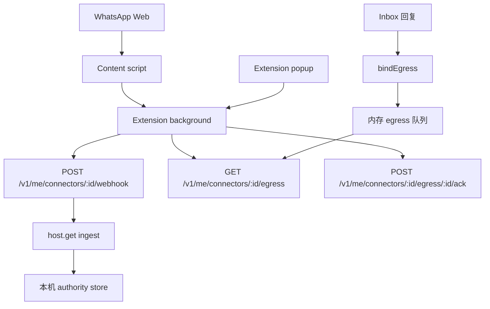

# WhatsApp Web Live Connector

- **English:** [../en/WHATSAPP_WEB_LIVE_CONNECTOR.md](../en/WHATSAPP_WEB_LIVE_CONNECTOR.md)
- **相关：** [个人 WhatsApp Bridge](WHATSAPP_PERSONAL.md) · [连接器](CONNECTOR.md) · [内置连接器](CONNECTOR_DRIVERS.md) · [个人 WhatsApp 测试与验收](WHATSAPP_PERSONAL_TESTING.md)
- **状态：** 本地 MVP
- **驱动：** `whatsapp-web-live`
- **来源：** `whatsapp-personal`（与个人导出导入相同）
- **来源模式：** `webhook`

## 边界

WhatsApp Web live connector 是一个本机 `ChannelDriver`。用户自己登录 WhatsApp Web
后，本地 MV3 扩展会读取**左侧可见会话列表**（依次点开，上限 30 个），把消息送进普通连接器 webhook，再从
Inbox 回复。回复时若当前不是目标聊天，扩展会先点开对应会话再填草稿或发送。

这条路径不使用 WhatsApp Business API，不绕过浏览器登录，不收集 Cookie，不把数据
存到云端，也不得用于批量营销或未经请求的自动发送。Regenic 不把该扩展发布到浏览
器商店。

聊天身份是 WhatsApp JID（`@c.us` / `@g.us` / `@lid`），与 Purr / Export 导入同一
套。可见标题只做展示名。标题 slug 和认不出的 DOM 行会被丢掉，不会当成 message
入库。

发送走 `bindEgress`。Inbox 回复表示用户已经确认正文（`send_now: true`）。扩展仍
然不会点击 WhatsApp 发送按钮，除非同时打开 **Allow commands to click WhatsApp's
send button**。

## 架构



MVP 使用 localhost HTTP。采集和回复由内核拥有。content script 观察页面，依次点开
可见会话，并把发送命令应用到目标聊天。所有 live HTTP 都经扩展 background worker 发出，因此
WhatsApp Web 不是 personal API 的 CORS origin。

扩展重新加载或 WhatsApp 页面刷新后，**同步可见会话** 会请求 background worker
恢复长期运行的 content script。一次性 page probe 只读页面，不会把消息写入
inbox。

## 安装

以 loopback 启动 personal API。**不必**先设置 live-key 环境变量。

```powershell
$env:LISTEN_HOST="127.0.0.1"
$env:PORT="4370"
$env:REGENIC_DATABASE="$PWD\regenic.db"
$env:REGENIC_BLOB_ROOT="$PWD\blobs"
pnpm --filter @regenic/api start
```

在 Engine 安装 **WhatsApp Web**。安装按钮可以直接点。安装时会生成**配对码**
（写入本机钥匙串），并在界面上显示一次，供你贴进浏览器扩展。配对码用来证明
扩展在和你本机的 Regenic 说话，**不是** WhatsApp 密码。

`REGENIC_PERSONAL_LIVE_KEY` 仍是可选的 CLI 覆盖项。产品界面不会让你去设它。
该驱动是 singleton。

扩展只走通用连接器路由，没有 `/v1/me/live/whatsapp/*` API。

| Method | Path | 用途 |
| --- | --- | --- |
| `GET` | `/v1/me/engine` | 查找已启用的 `whatsapp-web-live` 安装 |
| `POST` | `/v1/me/connectors/:id/webhook` | 写入一条观察到的 WhatsApp Web 消息 |
| `GET` | `/v1/me/connectors/:id/egress` | 轮询待执行发送命令 |
| `POST` | `/v1/me/connectors/:id/egress/:commandId/ack` | 确认命令已处理 |
| `GET` | `/v1/me/connectors/:id/pairing-code` | 再次查看扩展用的配对码 |
| `POST` | `/v1/me/replies` | 经 `bindEgress` 入队发送 |

扩展通过 `x-regenic-live-key` 发送配对码。任何带浏览器 Origin header 的请求
都必须匹配配对码（或可选的环境变量覆盖），否则会被拒绝。未带 Origin 的本机
CLI 请求仍可用。如果 API 不是绑定在 loopback 地址，该驱动也会拒绝工作。

命令在 5 分钟后过期；内存队列按 installation 隔离，最多保留 100 条待处理命令，
同一聊天每 2 秒最多入队一次。

## 构建并加载扩展

```powershell
pnpm --filter @regenic/web-extension-whatsapp build
```

在 Edge 或 Chrome 中加载：

1. 打开 `edge://extensions` 或 `chrome://extensions`。
2. 打开开发者模式。
3. 选择 **Load unpacked**。
4. 选择 `packages/web-extension-whatsapp/dist`。
5. 改过代码后要点 **重新加载**，并刷新已打开的 WhatsApp Web 标签。
6. 点工具栏里的扩展图标（可先把它钉在工具栏上）。面板会停在浏览器**右侧**，和 X 插件一样。把 Engine 安装后显示的**配对码**贴进去并保存。
   这不是 WhatsApp 密码；Installation id 和 API 地址一般不用动。
7. 打开 `https://web.whatsapp.com`，保持左侧会话列表可见，再点 **同步可见会话**。扩展会依次点开列表里的对话（最多 30 个）并读入 Inbox。
8. 成功时底部会显示 `synced N chats`。人名不能当 ID 用；扩展会从页面数据或本机记录反查 WhatsApp ID。
9. 第一次测试保持「允许扩展点击发送」关闭。Inbox 回复会先打开对应聊天，再把正文填进输入框。

## 手动测试

1. 启动本机 API，并在 Engine 安装 `whatsapp-web-live`。复制配对码。
2. 构建并加载扩展。
3. 用户自己登录 `https://web.whatsapp.com`。
4. 保持左侧会话列表可见。
5. 打开 popup 并点击 **同步可见会话**。
6. 用另一个 WhatsApp 账号给当前账号发一条唯一测试消息。
7. 打开 Regenic Inbox，确认消息只出现一次，`can_send` 为 true，
   `conversation_kind` 为 `direct` 或 `group`，`event.source` 为
   `whatsapp-personal`。线程 id 是 `whatsapp-personal:<jid>`。
   同一 WhatsApp 会话在 Inbox 里应只有一行。若旧版已把同一群拆成多行，先折叠那些孤儿行再重新同步。
   同步会等会话面板稳定后再读消息；电话号码会话按数字匹配，不要求标题字符串完全一致。
8. 保持同一个聊天在 WhatsApp Web 中打开，从 Inbox 回复：

```powershell
Invoke-RestMethod -Method Post `
  -Uri http://127.0.0.1:4370/v1/me/replies `
  -ContentType "application/json" `
  -Body '{"thread_id":"whatsapp-personal:15550001@c.us","text":"Test draft from Regenic"}'
```

9. 确认扩展只把文本填入输入框，没有点击发送。
10. 只有在受控测试中才打开扩展里的发送开关。Inbox 回复本身已经是确认发送。

## 安全规则

- API 保持绑定在 `127.0.0.1`。
- 把 Engine 的配对码贴进扩展。不要把配对码写进安装 config。
- 扩展的 API origin 必须是 loopback。content script 不会直接请求本机 API。
- 先关闭扩展发送开关做验证。
- 不要给扩展无法打开的聊天入队发送命令。
- 命令 delay 结束后，扩展会再次确认当前会话；对不上就先切回目标聊天，切不过去才中止。
- 不要把该 connector 用于批量触达、抓取或未经请求的自动回复。
- 不要在 live connector 中保存生产密钥、浏览器 Cookie 或 npm token。
- 点击 Send 前，扩展会在本地保存 command UUID，以及当时屏幕上已有的同文本
  outgoing 气泡 ID，但不保存消息正文。只有观察到新的同文本 outgoing 气泡后才
  ACK。若无法确认投递，命令保持 pending，扩展也不会再次点击 Send；它最终随服务
  端 TTL 过期。
- Inbox 回复在 WhatsApp Web 上的回声会写成同一个 `:out:<command id>`，不会变成
  第二条消息。

## 当前 MVP 限制

- connector 依赖 WhatsApp Web DOM selector，页面改版后可能失效。
- 没有 WhatsApp JID 的消息会丢掉。群聊入站对齐 whatsapp-web.js 的 `author` +
  `notifyName`：气泡上的手机号写成 `actor_id`（`+34 …` → `3460…@c.us`），`~
  人名` 写成 `actor_label`。`fromMe` 用 WhatsApp 自己的发出标记（`true_` /
  `message-out` / 发送勾），不用 `data-pre-plain-text` 里的 push name。自己发
  的气泡是 `local-owner`，Inbox 显示「你」；`Jeson Li` 这种本机显示名不会当成
  别人。当前 WhatsApp Web 经常不再在 `data-id` 上带 `true_`/`false_`，发出判定
  会看同一行上的发送勾 / `tail-out`，以及气泡更靠右。同一条消息再同步时，若只
  是说话人方向修正过，内核会 revise，Inbox 会改成「你」，不会留下旧的对方气泡。
- 发送命令只保存在内存中，5 分钟后过期，API 重启后也会消失。
- 同步范围是当前列表里可见的会话（滚动加载后最多 30 个），不是整本聊天记录的离线导出。
- 发送时扩展会先打开目标聊天；找不到对应行则命令保持 pending 直到过期。
- MVP 假设只有一个活动扩展实例；命令不会在多个浏览器或 profile 之间租约。
- 自动发送只执行外部提供的文本，不会自动生成回复。
- 连接就绪、attach、popup 自检等诊断事件不会写入 inbox。
- 页面自动化路径稳定后，可用 WebSocket 或 Native Messaging 替换轮询。
