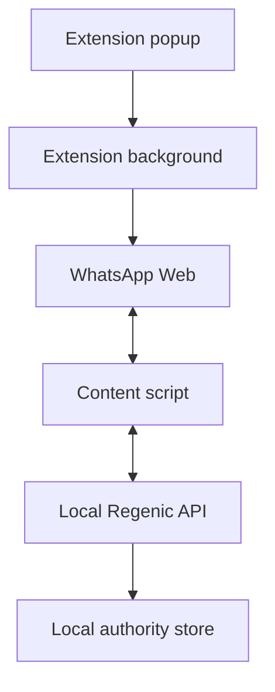

# WhatsApp Web Live Connector

- **English:** [../en/WHATSAPP_WEB_LIVE_CONNECTOR.md](../en/WHATSAPP_WEB_LIVE_CONNECTOR.md)
- **相关：** [个人 WhatsApp Bridge](WHATSAPP_PERSONAL.md) · [个人 WhatsApp 测试与验收](WHATSAPP_PERSONAL_TESTING.md)
- **状态：** 本地 MVP

## 边界

WhatsApp Web Live Connector 是一个本地浏览器扩展 MVP，面向已经由用户自己登录的
WhatsApp Web 页面。它观察当前 WhatsApp Web 中可见的消息，把消息事件上报到本机
Regenic personal API，并轮询本地发送命令。发送命令默认只填入草稿；只有服务端命令设置
`send_now: true`，且扩展设置中打开 **Allow commands to click WhatsApp's send button**
时，扩展才会点击 WhatsApp 的发送按钮。

该 connector 不使用 WhatsApp Business API，不绕过浏览器登录，不收集 Cookie，不把数据
存到云端，也不得用于批量营销或未经请求的自动发送。

## 架构



MVP 使用 localhost HTTP。HTTP API 由本机 API 拥有；扩展只负责观察页面、转发消息事件、
轮询发送命令，并把命令应用到当前打开的聊天。扩展重新加载或 WhatsApp 页面刷新后，
**Reconnect page** 会请求 background worker 恢复长期运行的 content script。

## 本机 API

以 loopback 启动 personal API：

```powershell
$env:LISTEN_HOST="127.0.0.1"
$env:PORT="4370"
$env:REGENIC_DATABASE="$PWD\regenic.db"
$env:REGENIC_BLOB_ROOT="$PWD\blobs"
$env:REGENIC_PERSONAL_LIVE_KEY=[guid]::NewGuid().ToString("N")
pnpm --filter @regenic/api start
```

Live endpoints：

| Method | Path | 用途 |
| --- | --- | --- |
| `GET` | `/v1/me/live/whatsapp/status` | 查看 connector 状态 |
| `POST` | `/v1/me/live/whatsapp/messages` | 接收 WhatsApp Web 观察到的消息 |
| `POST` | `/v1/me/live/whatsapp/send` | 入队草稿或发送命令 |
| `GET` | `/v1/me/live/whatsapp/commands` | 轮询待执行命令 |
| `POST` | `/v1/me/live/whatsapp/commands/:id/ack` | 确认命令已处理 |

客户端通过 `x-regenic-live-key` 发送 `REGENIC_PERSONAL_LIVE_KEY`。任何带浏览器 Origin
header 的请求都必须配置并匹配该 key，否则会被拒绝。未设置 key 时，无 Origin header 的
本机 CLI 请求仍可用，但建议始终配置 key。如果 API 不是绑定在 loopback 地址，live
connector 也会拒绝访问。

命令在 5 分钟后过期；内存队列最多保留 100 条待处理命令，避免扩展离线时无限积压或恢复后
执行陈旧命令。

## 构建并加载扩展

构建扩展包：

```powershell
pnpm --filter @regenic/web-extension-whatsapp build
```

在 Edge 或 Chrome 中加载：

1. 打开 `edge://extensions` 或 `chrome://extensions`。
2. 打开开发者模式。
3. 选择 **Load unpacked**。
4. 选择 `packages/web-extension-whatsapp/dist`。
5. 打开 popup，确认其中显示 **Version**。
6. 打开扩展设置。
7. 将 **Local API origin** 设为 `http://127.0.0.1:4370`。
8. 将 **Live API key** 设为 `REGENIC_PERSONAL_LIVE_KEY` 的值。
9. 第一次测试时保持 **Allow commands to click WhatsApp's send button** 关闭。
10. 先执行 **Test connection**，再打开 WhatsApp Web 并点击 **Reconnect page**。
11. 只有 **Page scan** 以 `connected:` 开头时才继续。

## 手动测试

1. 启动本机 API。
2. 构建并加载扩展。
3. 用户自己登录 `https://web.whatsapp.com`。
4. 打开一个测试聊天。
5. 打开 popup 并点击 **Reconnect page**。
6. 用另一个 WhatsApp 账号给当前账号发一条唯一测试消息。
7. 打开 Regenic Inbox，确认消息只出现一次且方向正确。
8. 在 5 分钟内入队一条草稿命令；将 `<title-slug>` 替换为当前打开聊天对应的小写 slug：

```powershell
Invoke-RestMethod -Method Post `
  -Uri http://127.0.0.1:4370/v1/me/live/whatsapp/send `
  -Headers @{ "x-regenic-live-key" = $env:REGENIC_PERSONAL_LIVE_KEY } `
  -ContentType "application/json" `
  -Body '{"conversation_id":"whatsapp-personal:<title-slug>","text":"Test draft from Regenic","send_now":false}'
```

9. 保持同一个聊天在 WhatsApp Web 中打开。
10. 确认扩展只把文本填入输入框，没有点击发送。
11. 只有在受控测试中才启用真实发送：API 请求设置 `send_now: true`，同时打开扩展里的发送
    开关。

## 安全规则

- API 保持绑定在 `127.0.0.1`。
- 真实测试时设置 `REGENIC_PERSONAL_LIVE_KEY`。
- 先使用草稿模式验证。
- 不要给当前没有打开的聊天入队发送命令。
- 如果可能存在两个同名聊天，不要启用自动发送。
- 不要把该 connector 用于批量触达、抓取或未经请求的自动回复。
- 不要在 live connector 中保存生产密钥、浏览器 Cookie 或 npm token。
- 点击 Send 前，扩展会在本地保存 command UUID，以及当时屏幕上已有的同文本 outgoing
  气泡 ID，但不保存消息正文。只有观察到新的同文本 outgoing 气泡后才 ACK。若无法确认投递，
  命令保持 pending，扩展也不会再次点击 Send；它最终随服务端 TTL 过期。

## 当前 MVP 限制

- connector 依赖 WhatsApp Web DOM selector，页面改版后可能失效。
- chat identity 是从可见标题得到的低置信度 slug，不是 WhatsApp JID，无法区分两个同名聊天。
- 发送命令只保存在内存中，5 分钟后过期，API 重启后也会消失。
- 只有当前打开的聊天能接收草稿或发送命令。
- MVP 假设只有一个活动扩展实例；命令不会在多个浏览器或 profile 之间租约或隔离。
- 自动发送只执行外部提供的文本，不会自动生成回复。
- MVP 尚未包含完整 LLM 回复流水线或多平台 dashboard。
- 页面自动化路径稳定后，可用 WebSocket 或 Native Messaging 替换轮询。